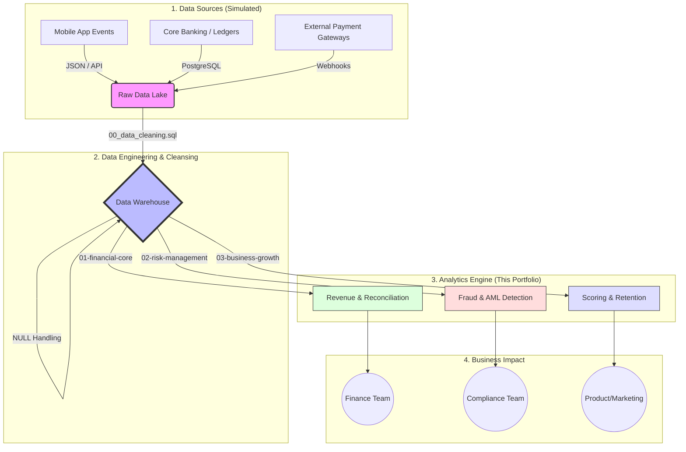

# Fintech SQL Analytics Portfolio

Production-grade SQL analytical framework for fintech environments. Focused on revenue recognition, automated fraud detection, and cohort retention analysis.

---

## Data Architecture & Flow

This portfolio demonstrates a comprehensive understanding of how data moves from application events to financial reconciliation in a modern Fintech environment.

---

## Key Business Insights

Beyond writing complex SQL, these scripts are designed to drive actionable business decisions:

### 1. Risk & Compliance (AML)
- **Account Takeover Detection:** Monitored via night-audit scripts (`06_night_audit.sql`), enabling the automatic freezing of accounts transacting during high-risk hours (11 PM - 5 AM).
- **Structuring (Smurfing) Prevention:** `02_daily_activity.sql` identifies users attempting to evade regulatory reporting limits by breaking large transfers into multiple smaller ones.

### 2. Growth & Product Strategy
- **Cohort Retention Pivot:** `07_cohort_retention.sql` highlights whether user acquisition campaigns yield long-term LTV or if users churn after the first month.
- **Pinpointing Funnel Friction:** `09_kyc_conversion_funnel.sql` identifies exactly where users drop off during the legal identity verification process, allowing Product Managers to optimize the UI.
- **Credit Scoring Engine:** `05_credit_scoring.sql` categorizes users into "Whales" vs "Loyal" customers, enabling automated pre-approvals for premium credit cards.

### 3. Financial Operations
- **Ghost Money & Reconciliation:** `08_bank_reconciliation.sql` automates the grueling task of matching internal database records against external gateway logs (like Stripe or Central Banks) using `FULL OUTER JOIN`s, immediately flagging discrepancies and hidden fees.
- **Profitability Metrics:** `01_net_revenue.sql` and `03_profitability_commissions.sql` track net transaction volumes and simulate pricing tiers to identify the highest-margin clients.

---

## Project Structure

- `analytics-engine/00-setup-and-cleaning/`: DDL Mock Data & String Normalization.
- `analytics-engine/01-financial-core/`: Net Revenue & Bank Reconciliations.
- `analytics-engine/02-risk-management/`: Night Audits & AML Monitoring.
- `analytics-engine/03-business-growth/`: Cohort Retention, KYC Funnels & Scoring.
